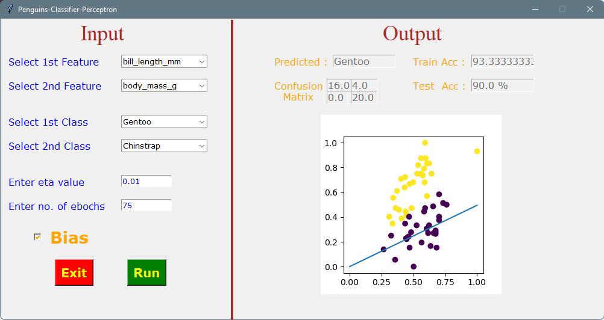

> ## ***Penguins Classifier Perceptron***
> | ***BIO9*** | ***ahmednasser1601@gmail.com*** |
> | :-: | :-: |

> ***Tasks Delivery State***
>> | <li>[x] ***1st***</li> | <li>[ ] ***2nd***</li> |
>> | :-: | :-: |
>>
>> | <a href="Model.ipynb">***Model***</a> | <a href="GUI.ipynb">***GUI***</a> | <a href="penguins.csv">***Dataset***</a> | <a href="***Task Description.pdf">***Description***</a> |
>> | :-: | :-: | :-: | :-: |

> 

<!--
> | <a href="https://github.com/AhmedNasser1601">Ahmed Nasser</a> | <a href="https://github.com/YossefEFM">Yossef Essam</a> | <a href="https://github.com/dohaabdelfatah">Doha Abdelfattah</a> | <a href="https://github.com/mohamedKhaledBio">Mohamed Khaled</a> | <a href="https://github.com/abdelrahman-sedeek">Abdelrahman Tolba</a> |
> | :-: | :-: | :-: | :-: | :-: |
> | 20191701016 | 20191701269 | 20191701116 | 20191701163 | 20191701121 |
-->
