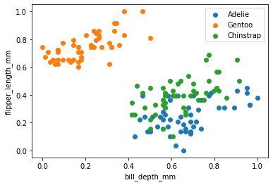
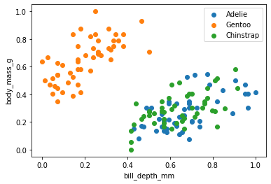

<table align="center"><tr><td><b>BIO9</b></td><td><a href="Penguins Classifier"><b>Penguins Classifier</b></a></td><td></td></tr></table>

| X1-X2 | X1-X3 | X1-X4 | X1-X5 | X2-X3 |
| :-: | :-: | :-: | :-: | :-: |
| X2-X4 | X2-X5 | X3-X4 | X3-X5 | X4-X5 |

| ***Used Algorithm*** | DEMO |
| :-: | :-: |
| <a href="Single Layer Perceptron">***Single Layer Perceptron***</a> |  |
| <a href="Adaline Algorithm">***Adaline Algorithm***</a> |  |
| <a href="Back Propagation Multilayer">***Back Propagation Multilayer***</a> |  |
