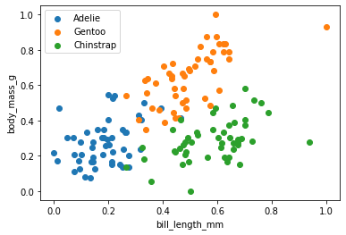
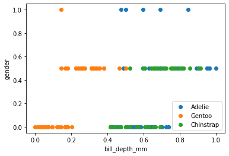

> 
> | ***BIO9*** | <a href="https://github.com/AhmedNasser1601/Penguins-Classifier">***Penguins Classifier***</a> |  |
> | :-: | :-: | :-: |

> ***Tasks Delivery State***
>> | <li>[x] <a href="Single Layer Perceptron">***1st***</a></li> | <li>[x] <a href="Adaline Algorithm">***2nd***</a></li> | <li>[ ] <a href="Back Propagation Multilayer">***3rd***</a></li> |
>> | :-: | :-: | :-: |

> ***Team Members***
>> | <a href="https://github.com/AhmedNasser1601">***Ahmed***</a> | <a href="https://github.com/YossefEFM">***Yossef***</a> | <a href="https://github.com/dohaabdelfatah">***Doha***</a> | <a href="https://github.com/mohamedKhaledBio">***Mohamed***</a> | <a href="https://github.com/abdelrahman-sedeek">***Abdelrahman***</a> |
>> | :-: | :-: | :-: | :-: | :-: |

> ***Dataset Features Visualizations***
>> | X1-X2 | X1-X3 | X1-X4 | X1-X5 | X2-X3 |
>> | :-: | :-: | :-: | :-: | :-: |
>> | X2-X4 | X2-X5 | X3-X4 | X3-X5 | X4-X5 |

---

> | ***Used Algorithm*** | DEMO |
> | :-: | :-: |
> | ***Single Layer Perceptron*** |  |
> | ***Adaline Algorithm*** |  |
> | ***Back Propagation Multilayer*** |  |
